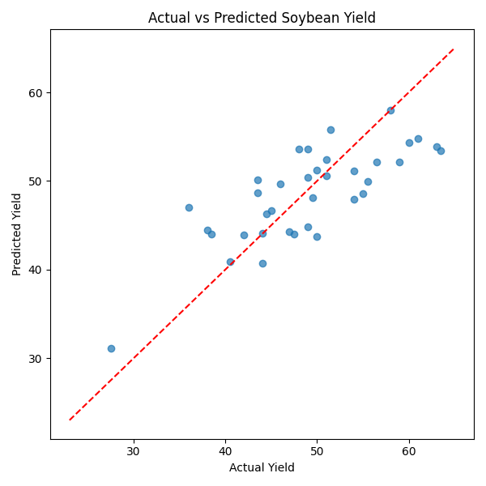

# Annual_soybean_yields

This project predicts annual soybean yields at the US state level using climate features such as temperature and precipitation. It's part of a technical assessment focused on modeling, feature engineering, and model evaluation.

## Folder structure

```plaintext
soybean-yield-prediction/
│
├── data/
│ ├── 2t.csv # Daily max temperature (K)
│ ├── tp.csv # Daily total precipitation (mm)
│ ├── yield.csv # Annual soybean yields
│ └── df_processed.csv # Final feature-engineered dataset
│
├── notebooks/ # Jupyter notebooks for EDA and model development
│ ├── EDA_and_processing.ipynb # Data exploration and processing logic
│ └── model.ipynb # Model experimentation and training logic
│
├── outputs/
│ └── figures/ # Contains plots like yield_predictions.png
│
├── scripts/ # Python scripts for reproducibility
│ ├── data_processing.py # Script to generate df_processed.csv
│ └── train_and_evaluate_model.py # Model training, evaluation, plotting
│
├── requirements.txt
├── instruction.txt # Technical test instructions
└── README.md # Project overview and documentation
```

## Dataset

- `yield.csv`: annual yield by state
- `2t.csv`: daily max temperature (K)
- `tp.csv`: daily total precipitation (mm)

## Methods

- Feature engineering: Growing Degree Days, seasonal aggregates, etc.
- Models tried:
  - Linear Regression
  - Random Forest Regressor
  - XGBoost Regressor
- Best model: **XGBoost** (lowest RMSE on 5-fold CV)

## Results

Final RMSE (cross-validation): `XX.X`

Example plot: Predicted vs Actual Yields (2020)



## Usage

To run the project:

```bash
pip install -r requirements.txt
python scripts/data_processing.py
python scripts/train_and_evaluate_model.py
```
