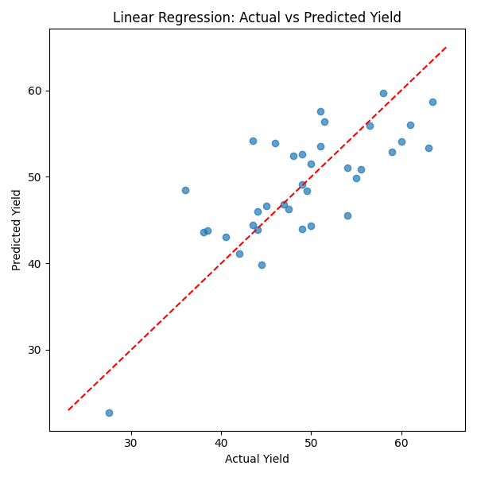

# Annual_soybean_yields

This project predicts annual soybean yields at the US state level using climate features such as temperature and precipitation. It's part of a technical assessment focused on modeling, feature engineering, and model evaluation.

## Folder structure

```plaintext
soybean-yield-prediction/
│
├── data/
│ ├── 2t.csv # Daily max temperature (K)
│ ├── tp.csv # Daily total precipitation (mm)
│ ├── yield.csv # Annual soybean yields
│ └── df_processed.csv # Final feature-engineered dataset
│
├── notebooks/ # Jupyter notebooks for EDA and model development
│ ├── EDA_and_processing.ipynb # Data exploration and processing logic
│ └── model.ipynb # Model experimentation and training logic
│
├── outputs/
│ └── figures/ # Contains plots like yield_predictions.png
│
├── scripts/ # Python scripts for reproducibility
│ ├── data_processing.py # Script to generate df_processed.csv
│ ├── train_and_evaluate_model_linear.py # Model training using linear regression, evaluation, plotting
│ └── train_and_evaluate_model_rf.py # Model training using random forest, evaluation, plotting
│
├── requirements.txt
├── instruction.txt # Technical test instructions
└── README.md # Project overview and documentation
```

## Dataset

- `yield.csv`: annual yield by state
- `2t.csv`: daily max temperature (K)
- `tp.csv`: daily total precipitation (mm)

## Methods

- Feature engineering: Aggregated daily temperature and precipitation data during the May–September growing season by state and year to compute averages, extremes, and counts of hot, dry, and flooding days, then merged the results with annual yield data.
- Models tried:
  - Linear Regression (with features normalization)
  - Random Forest Regressor
- Best performing model: **Linear Regression**

## Results

Best metric on 5-fold CV:

- Average MAE: 3.86
- Average RMSE: 4.73
- Average R²: 0.603



## Usage

To run the project:

- clone the repo or unzip the compressed folder

```bash
cd Annual_soybean_yields
pip install -r requirements.txt
python scripts/data_processing.py
python scripts/train_and_evaluate_model_rf.py   or   python scripts/train_and_evaluate_model_linear.py
```
